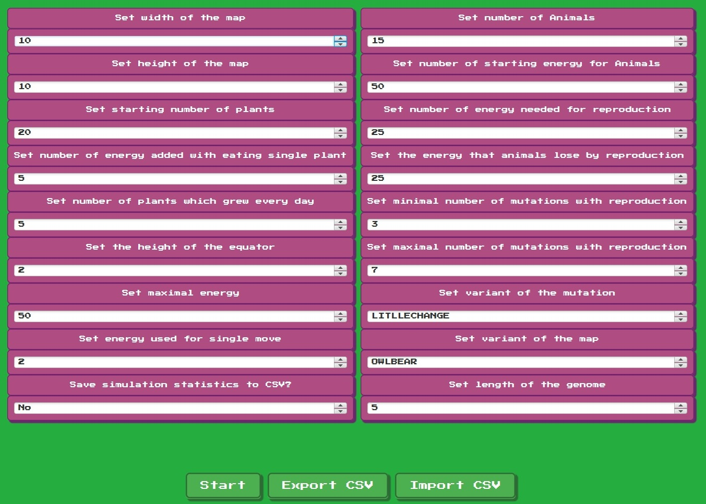

# Simulation Engine -> Darwin World  

## Overview  
**Darwin World** is a simulation that models the evolution of virtual creatures in a dynamic environment. The project implements a range of mechanics related to natural selection, resource competition, and AI-driven behavior.  

## Implemented Features  

### 🦠 **Creatures & Evolution**  
- **Genetic System**: Each creature has a genome influencing its physical traits and behaviors.  
- **Mutation Mechanism**: Random mutations occur during reproduction, introducing variation.  
- **Natural Selection**: More adaptable creatures have a higher survival rate and reproduce more.  

### 🌍 **Environment & Resources**  
- **Procedural World Generation**: The world is dynamically created with different terrains.  
- **Food & Energy System**: Creatures must seek food to survive, influencing their behavior.  
- **Environmental Hazards**: Certain areas pose risks, forcing creatures to adapt or migrate.  

### 🧠 **AI & Behavior**  
- **Basic Neural Network**: Each creature has a simple AI controlling movement and decision-making.  
- **Pathfinding**: Creatures can navigate toward food sources while avoiding obstacles.  
- **Learning & Adaptation**: Over time, populations develop more efficient survival strategies.  

### 🔄 **Simulation & Visualization**  
- **Real-time Simulation**: The world updates dynamically, showing changes in populations.  
- **Graphical Representation**: Creatures and environments are visually displayed.  
- **Statistics & Data Logging**: Key metrics (population size, mutation rates, survival rates) are tracked.

### 📷 **Screenshots**

### 🎥 **Video**
https://github.com/user-attachments/assets/00d52393-7825-4a42-bf6c-89c4a52a93f7

